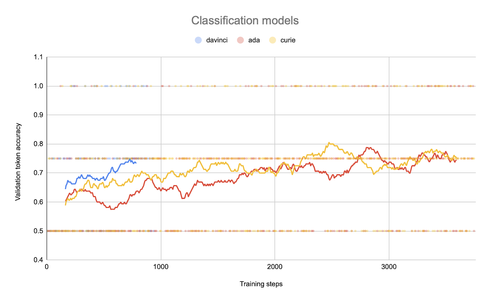

# News to emoji

This project demonstrates how to fine-tune OpenAI GPT models for news classification tasks. It also includes the source code for the [Streamlit](https://streamlit.io) application, available online at [news2emoji](https://news2emoji.streamlit.app).

## Scripts

The scripts have a numerical prefix associated with the execution order. Also, the Makefile includes few commands with the OpenAI CLI tool.

## Dataset

The dataset consists of the short news messages extracted from the [Telegram](https://telegram.org) channel [@varlamov_news](http://t.me/varlamov_news). Each message has reactions with a maximum of 10 mutually exclusive emoticons. This means that the person can only select one emoji per news post.

```python
completion_mapping = {
    "❤️": "heart",
    "👍": "positive",
    "👎": "negative",
    "🤔": "thinking",
    "😢": "cry",
    "🤣": "laughing",
    "😱": "scream",
    "🤬": "symbols",
    "🤡": "clown",
    "💩": "shit",
}
```

## Classification models

In this task the model predicts a single token.

| model | trained tokens | costs |
| ----- | -------------: | ----: |
| ada   | 2,615,288      | $1.05 |
| curie | 2,615,288      | $7.85 |
| davinci | 653,822      | $19.61|

This chart shows the `Validation loss`.


This chart shows the `Validation token accuracy`.



## Generation models

In this task the model predicts a sequence of tokens.

| model | trained tokens | costs |
| ----- | -------------: | ----: |
| ada   | 1,721,474      | $0.69 |
| curie | 1,721,474      | $5.16 |

This chart shows the `Validation loss`.


## spaCy baseline

The simple `spaCy` baseline model achieved only `36%` accuracy.

### spaCy tutorial
* https://spacy.io/usage/training
* https://spacy.io/api/scorer#score_cats
* https://towardsdatascience.com/sarcasm-text-classification-using-spacy-in-python-7cd39074f32e

## TODO
- [ ] Fine-tune and evaluate more generations models
- [ ] Build a strong baseline model
